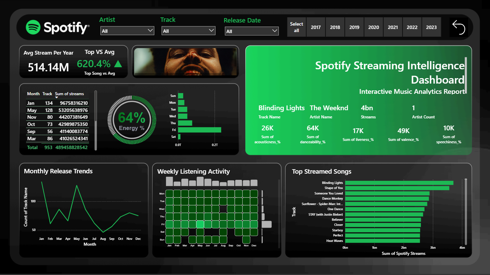

# Spotify Streaming Intelligence Dashboard

## Overview
An interactive Power BI dashboard developed to analyze Spotify streaming trends, artist popularity, and music performance using business intelligence visualizations.

## Features
- KPI Monitoring
- Top Streamed Songs Analysis
- Artist Performance Tracking
- Monthly Release Trends
- Interactive Filters
- Data Visualization

## Tech Stack
- Power BI
- Python
- Pandas
- CSV Dataset

## Dashboard Preview

## Key Insights
- Identified top-performing tracks and artists
- Analyzed streaming engagement metrics
- Visualized monthly music release activity
- Compared popularity trends across songs